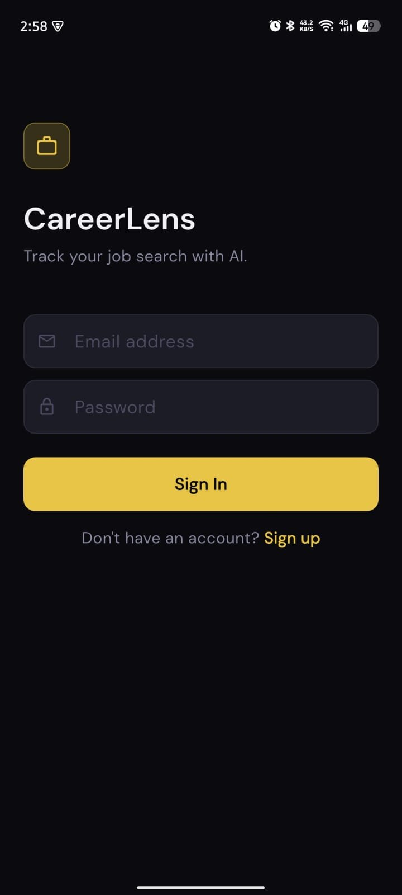
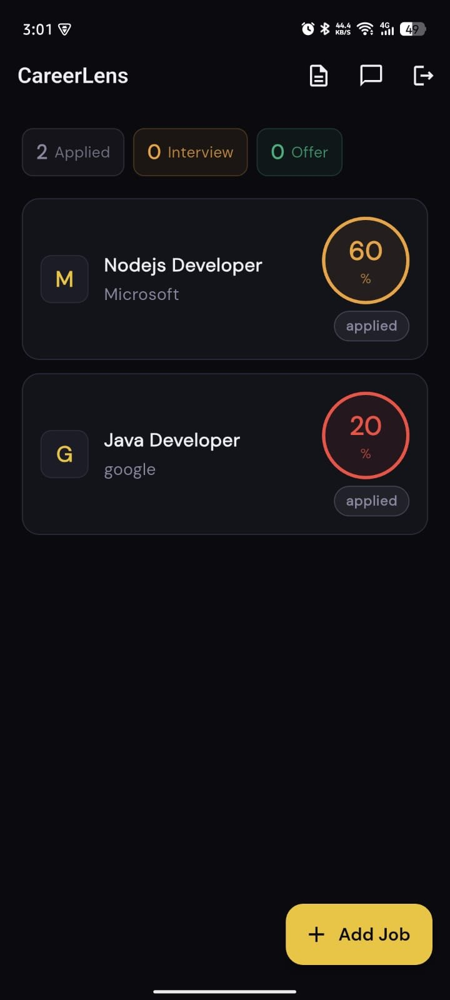
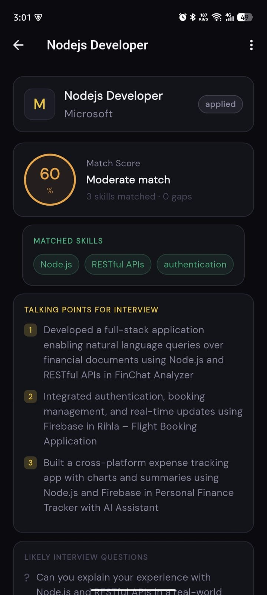
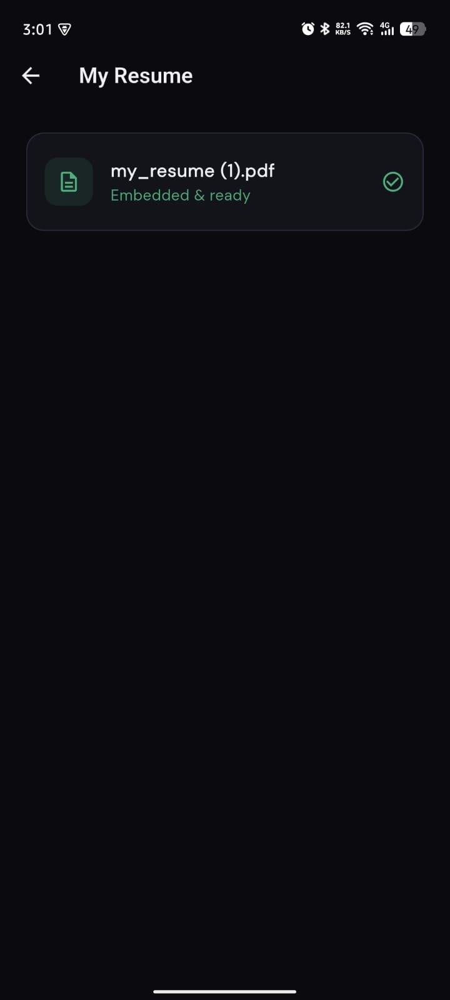
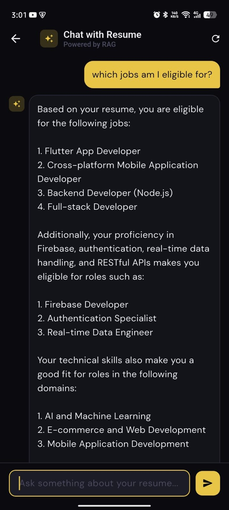

# CareerLens 🎯

> AI-powered job application tracker — paste a job description, get an instant match score against your resume, and track every application in one place.

<br/>

<p align="center">
  
  
  
  
  
</p>

<br/>

## What it does

Upload your resume once. Then for every job you find, paste the description and CareerLens tells you:

- **Match score** — how well your resume fits the role
- **Matched skills** — skills present in both your resume and the JD
- **Skill gaps** — what the job needs that you don't have yet
- **Interview talking points** — grounded in your actual projects
- **Likely interview questions** — based on the specific role
- **Chat with your resume** — ask anything, get answers from your actual resume via RAG

All of this is powered by a real RAG pipeline — not generic AI advice.

<br/>

## Stack

| Layer | Technology |
|---|---|
| Mobile | Flutter (MVVM + setState) |
| Auth & Database | Firebase Auth + Firestore |
| File Storage | Supabase Storage |
| Backend | Node.js + Express |
| AI Pipeline | LangChain.js + Groq (llama-3.3-70b) |
| Vector Store | Qdrant Cloud |
| Embeddings | HuggingFace Transformers (free, local) |
| Chat History | Redis (Upstash) |

<br/>

## How the RAG pipeline works

```
Resume Upload
    │
    ▼
PDF → LangChain PDFLoader
    │
    ▼
RecursiveCharacterTextSplitter (800 chunk, 100 overlap)
    │
    ▼
HuggingFace all-MiniLM-L6-v2 embeddings (free, runs locally)
    │
    ▼
Qdrant Cloud — stored in per-user collection: resume_{userId}

──────────────────────────────────────────────────────

Job Match Request
    │
    ▼
JD embedded → similarity search (top 6 resume chunks)
+ fixed skills query → merged & deduplicated
    │
    ▼
Groq LLM (llama-3.3-70b, temp=0.1) → structured JSON
    │
    ▼
{ matchScore, matchedSkills, skillGaps, talkingPoints, suggestedQuestions }
    │
    ▼
Saved to Firestore → rendered in Flutter
```

<br/>

## Project Structure

```
careerlens/
├── frontend/                          # Flutter app
│   └── lib/
│       ├── core/
│       │   ├── constants/             # API endpoints
│       │   ├── network/               # Dio client + Firebase token interceptor
│       │   ├── theme/                 # Dark theme, amber accent
│       │   └── utils/                 # Shared widgets
│       ├── features/
│       │   ├── auth/                  # Login, Signup
│       │   ├── resume/                # Upload + embed resume
│       │   ├── jobs/                  # Job list, add job
│       │   ├── match/                 # AI match analysis + job detail
│       │   └── chat/                  # Chat with resume (RAG)
│       ├── app_router.dart
│       └── main.dart
│
└── backend/
    └── src/
        ├── middleware/                # Firebase token verification
        ├── services/
        │   ├── embeddings.js          # Shared HuggingFace instance (init once)
        │   ├── qdrant.js              # Qdrant client — upsert + search
        │   ├── embedResume.js         # PDF → chunks → vectors → Qdrant
        │   ├── matchJob.js            # JD → RAG → structured JSON
        │   ├── chatResume.js          # Q&A over resume + Redis history
        │   └── redis.js               # Conversation history
        ├── routes/                    # /resume/embed, /match, /chat
        └── index.js
```

<br/>

## Screens

| Screen | Description |
|---|---|
| Login / Signup | Firebase email auth |
| Jobs List | All tracked jobs with match scores and status badges |
| Add Job | Paste any job description to save and analyze |
| Job Detail | Full match analysis — score, skills, gaps, talking points |
| My Resume | Upload PDF — embedded into Qdrant via AI pipeline |
| Chat with Resume | RAG-powered Q&A over your resume with conversation history |

<br/>

## Local Setup

### Backend

```bash
cd backend
npm install
cp .env.example .env
# Fill in: GROQ_API_KEY, QDRANT_ENDPOINT, QDRANT_API_KEY, REDIS_URL
# Add serviceAccountKey.json from Firebase Console → Service Accounts
node src/index.js
```

### Flutter

```bash
cd frontend
flutterfire configure       # generates firebase_options.dart
flutter pub get
flutter run
```

### Environment Variables

```env
GROQ_API_KEY=               # console.groq.com — free
QDRANT_ENDPOINT=            # cloud.qdrant.io — free tier
QDRANT_API_KEY=             # same dashboard
REDIS_URL=                  # upstash.com — free tier
FIREBASE_SERVICE_ACCOUNT_PATH=./serviceAccountKey.json
PORT=3000
```

<br/>

## API Endpoints

| Method | Endpoint | Description |
|---|---|---|
| POST | `/api/resume/embed` | Upload + embed resume PDF into Qdrant |
| POST | `/api/match` | Match job description against resume via RAG |
| POST | `/api/chat` | Chat with resume using RAG + Redis history |

All endpoints require Firebase Bearer token in `Authorization` header.

<br/>

## Built by

**Ghusharib Najam** — Flutter Developer  
[github.com/ghusharibdev](https://github.com/ghusharibdev) · [linkedin.com/in/ghusharib-najam-3a91531a4](https://linkedin.com/in/ghusharib-najam-3a91531a4)
